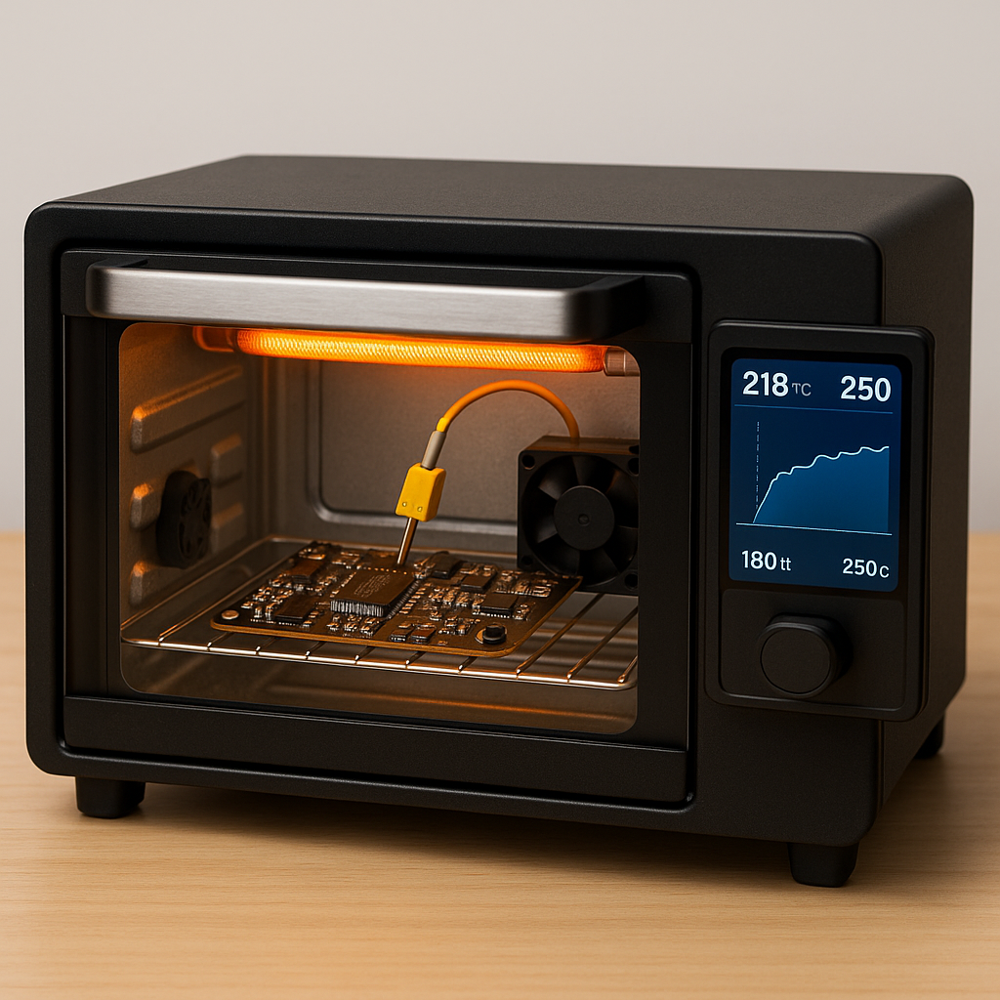

# Forno de Refusão — Interface (Frontend)

<div align="center">
  
</div>


Interface _touchscreen_ para um **forno de refusão (reflow oven)** usado na soldagem de
componentes **SMD** em placas de circuito impresso. A aplicação roda em um **Raspberry Pi /
Orange Pi** e se comunica por **RS422** com a placa de potência baseada em **STM32**,
permitindo configurar perfis, executar o processo e monitorar os sensores em tempo real.

> Toda a interface (textos e metadados) está em **português (pt-BR)**.

## ✨ Funcionalidades

- **Programas (perfis térmicos):** criar, editar e gerenciar perfis de temperatura × tempo.
- **Monitoramento em tempo real** das leituras da placa de potência:
  - Temperatura da grelha (termopar tipo K)
  - Temperatura do dissipador da placa de potência (NTC)
  - Corrente de saída da resistência (sensor de efeito Hall)
  - Tensões de entrada (127 VCA) e de saída (0–180 VCC)
  - RPM das ventoinhas (uma do forno e outra da placa de potência)
- **Execução:** acompanhar uma queima ao vivo com gráficos sincronizados (Temperatura,
  Tensão & Corrente e Ventoinhas) sobrepostos ao perfil programado.
- **Relatórios:** histórico de execuções, alterações e falhas, com gráficos interativos.
- **Configurações:** parâmetros gerais, usuários/permissões, rede, notificações/alertas,
  diagnóstico e calibração.
- **Falhas e alertas**; controle em malha fechada (**PID**) **planejado**.
- **Interface touchscreen** responsiva, otimizada para a base **1024×600** do Pi/Orange Pi.

## 🧰 Stack

| Camada       | Tecnologia                                                                  |
| ------------ | -------------------------------------------------------------------------- |
| Framework    | **Next.js 16** (App Router, **Turbopack**)                                  |
| UI           | **React 19** + **TypeScript**                                              |
| Estilo       | **Tailwind CSS v4** (tokens semânticos em `globals.css`), `clsx`            |
| Fontes       | **Nunito** (`next/font`) + **Material Symbols Rounded** (webfont)           |
| Persistência | `localStorage` (estágio _mock_ — backend via API/RS422 ainda por integrar) |

## 🔌 Pré-requisitos

- **Node.js 20.9+** (o ambiente de desenvolvimento usa a v24).
- **Yarn Classic (v1)** — este projeto usa `yarn.lock`; use `yarn`/`yarn add`, não `npm`.

## 🚀 Como rodar

```bash
yarn install     # instala as dependências
yarn dev         # servidor de desenvolvimento (Turbopack) em http://localhost:3000
```

Acesse [http://localhost:3000](http://localhost:3000). Na tela de login, a senha _mock_ de
todos os usuários é `1234` (ver `src/lib/auth.ts`).

## 📜 Scripts

| Comando      | Descrição                               |
| ------------ | --------------------------------------- |
| `yarn dev`   | Servidor de desenvolvimento (Turbopack) |
| `yarn build` | Build de produção (Turbopack)           |
| `yarn start` | Serve o build de produção               |
| `yarn lint`  | ESLint                                   |

> Ainda não há _test runner_ configurado.

## 📁 Estrutura do projeto

```
src/
├── app/                  # Rotas (App Router) — UI em pt-BR
│   ├── page.tsx          # Tela inicial / monitoramento
│   ├── login/            # Login + papéis (Admin / Regular)
│   ├── programas/        # Lista, novo (/novo) e edição (/[id]/editar) de perfis
│   ├── relatorios/       # Histórico e detalhe de execuções
│   ├── configuracoes/    # Abas: Geral, Usuários, Rede, Notificações, Diagnóstico, Calibração
│   ├── informacao/       # Tela de informações
│   ├── layout.tsx        # Fontes, metadados e chrome compartilhado
│   └── globals.css       # Tema e tokens de cor (claro/escuro)
├── components/           # Componentes de UI compartilhados
│   ├── AppShell, TopBar, BottomBar, Sidebar, MenuToggle      # navegação/chrome
│   ├── MultiAxisChart, SignalChart, TemperatureProfileChart  # gráficos
│   ├── RunModal                                              # tela de execução ao vivo
│   ├── ConfiguracoesScreen/, RelatoriosScreen/, ...          # telas por domínio
│   └── Modal, ConfirmDialog, Toaster, Pagination, ...        # primitivos
├── hooks/                # useStore, useSession, useLiveReadings, ...
└── lib/                  # auth, programs, reports, run, settings, limits, localStore, ...
```

## 🧭 Convenções

As regras detalhadas estão em **[`CLAUDE.md`](./CLAUDE.md)**. Em resumo:

- **Lint/format** aplicados (ESLint + Prettier): aspas duplas em `.ts`/`.tsx`, ponto e vírgula
  obrigatório, indentação de 2 espaços, largura de 150 caracteres.
- **Limites:** todo campo/lista que o usuário pode digitar ou crescer tem um teto explícito,
  centralizado em **`src/lib/limits.ts`** (constantes nomeadas; sem números mágicos).
- **Estilo de UI:** usar as classes utilitárias semânticas de `globals.css` (`.card`,
  `.btn-action`, `.btn-link`, etc.); todo botão tem animação de _hover_/_press_; dimensionar de
  forma fluida (`clamp()`) a partir da base **1024×600** do _touchscreen_.
- **Alias de import:** `@/*` aponta para `src/`.
- **Git:** desenvolvimento ativo na branch **`develop`** (à frente da `master`); mensagens de
  commit sempre em **inglês**.

## 📚 Documentação

- `docs/Esboço projeto.drawio` — desenho/arquitetura do projeto.
- `docs/MD_files/` — guias de _setup_ (ESLint, Prettier, EditorConfig, VS Code).

## 👨‍🔧 Autor

| Nome                               | GitHub                                              |
| ---------------------------------- | --------------------------------------------------- |
| Eng. Eletrônico Criador do Projeto | [@LegiusAndrade](https://github.com/LegiusAndrade/) |

## 🛡️ Licença

[](https://opensource.org/licenses/MIT)
