# Manual de Uso — Forno de Refusão (Reflow Oven)

Este manual explica, passo a passo e **com imagens**, como operar a interface do **forno de refusão** — o
equipamento que solda componentes SMD em placas de circuito (PCBs) seguindo um **perfil de temperatura × tempo**
(pré-aquecimento → patamar → pico de refusão → resfriamento). A interface roda na **tela sensível ao toque** do
equipamento e conversa, em tempo real, com a placa de potência que controla as resistências e lê os sensores.

> **Sobre as imagens:** todas as telas deste manual foram capturadas do sistema real, na resolução do
> equipamento (**1024 × 600**). Em monitores maiores (≥ 1280 px de largura) o layout se adapta — o menu vira
> uma barra lateral fixa (ver [3. A interface](#3-a-interface)). Os nomes de programas, datas e leituras das
> imagens são de exemplo.

---

## Sumário

1. [Visão geral](#1-visão-geral)
2. [Acesso ao sistema (login)](#2-acesso-ao-sistema-login)
3. [A interface](#3-a-interface)
4. [Início — monitoramento](#4-início--monitoramento)
5. [Executar um programa](#5-executar-um-programa)
6. [Programas (perfis de temperatura)](#6-programas-perfis-de-temperatura)
7. [Relatórios](#7-relatórios)
8. [Notificações](#8-notificações)
9. [Configurações](#9-configurações)
10. [Informação](#10-informação)
11. [Permissões por tipo de usuário](#11-permissões-por-tipo-de-usuário)
12. [Solução de problemas](#12-solução-de-problemas)

---

## 1. Visão geral

O forno aquece a placa seguindo uma **curva de temperatura** programada, derretendo a pasta de solda e fixando
os componentes. A interface permite:

- **Criar e editar** perfis de temperatura (temperatura × tempo, com rampas);
- **Executar** um perfil e **acompanhar ao vivo** os sensores — termopar da grelha (tipo‑K), temperatura do
  dissipador, corrente de saída, tensões de entrada/saída e a rotação dos coolers;
- Consultar **relatórios** de execuções, alterações de programas e erros;
- **Configurar** o sistema (PID, forno), usuários, rede e notificações;
- Acompanhar **falhas e alertas** em tempo real.

O que você pode fazer depende do **seu tipo de usuário** (operador, administrador, etc.) — ver
[seção 11](#11-permissões-por-tipo-de-usuário).

---

## 2. Acesso ao sistema (login)

Ao ligar, o equipamento abre a tela de login.

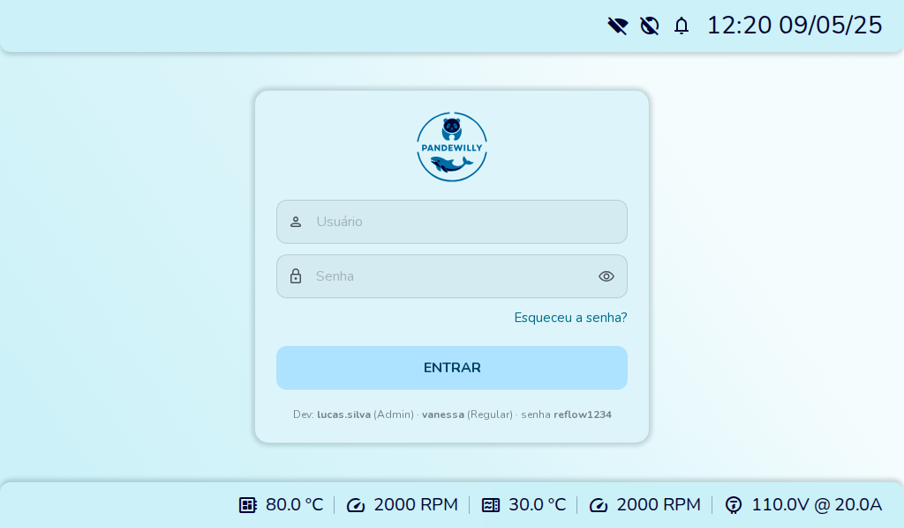

1. Toque no campo **Usuário** e digite seu nome de usuário (ex.: `joao.silva`).
2. Toque em **Senha** e digite sua senha. O ícone de olho (👁) à direita mostra/oculta a senha digitada.
3. Toque em **ENTRAR** (ou pressione *Enter* no teclado).

A tela usa o **teclado virtual** na tela de toque — ele aparece automaticamente ao focar um campo.

### Esqueci a senha

Toque em **Esqueceu a senha?**. Informe o **e‑mail cadastrado** e toque em **Enviar**: o sistema envia as
instruções de recuperação para esse e‑mail.

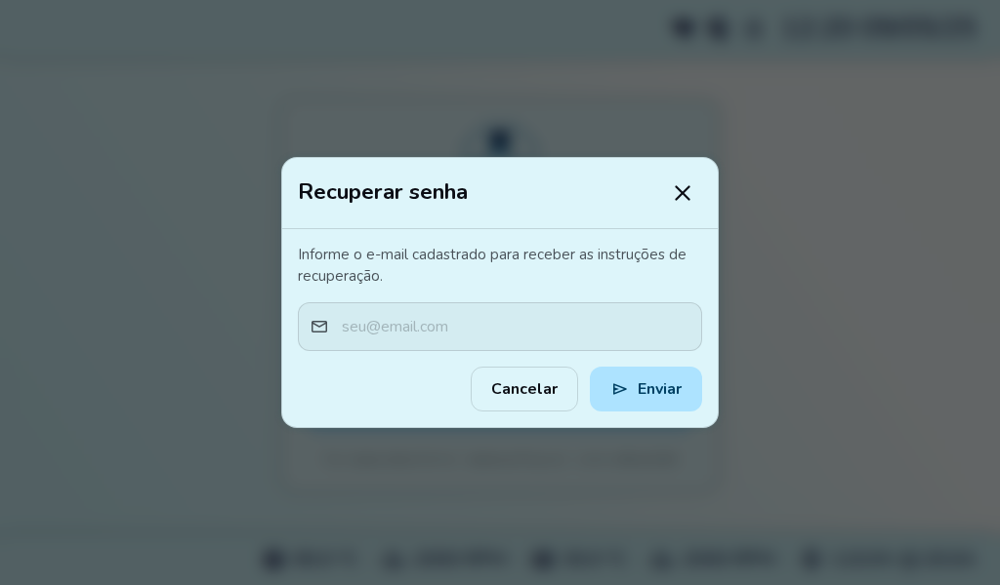

### Primeiro acesso / senha por e‑mail

Quando um administrador cria sua conta, **a senha é enviada por e‑mail** (você não a define no cadastro). Use a
senha recebida para entrar. Depois, você pode trocá‑la pelo menu **Trocar senha** (ver [seção 3](#o-menu-de-navegação)).

---

## 3. A interface

Depois de entrar, todas as telas compartilham a mesma moldura: uma **barra superior**, uma **barra inferior** e
o **menu de navegação**.

### Barra superior (TopBar)

À **esquerda**: seu **nome de usuário**, um selo com seu **tipo** (Admin, Regular, Master…) e um **cronômetro
da sessão**. À **direita**, da esquerda para a direita:

- **Rede** — indica se a conexão local é por **cabo** ou **Wi‑Fi**;
- **Internet** (globo) — indica acesso à internet;
- **Sino** 🔔 — abre as [Notificações](#8-notificações); um número vermelho mostra quantas não foram lidas;
- **Tema** ☀/🌙 — alterna entre **claro e escuro** (ver abaixo);
- **Data e hora**.

### Barra inferior (BottomBar) — leituras ao vivo

Mostra as principais leituras dos sensores **em tempo real** durante todo o uso: temperaturas (grelha e
dissipador), rotação dos coolers (RPM) e a tensão/corrente de saída (ex.: `110.0 V @ 20.0 A`). Em telas
menores, o botão de **menu** (☰) fica no canto esquerdo desta barra.

### O menu de navegação

Toque no botão **☰ (Abrir menu)** para abrir a gaveta de navegação:

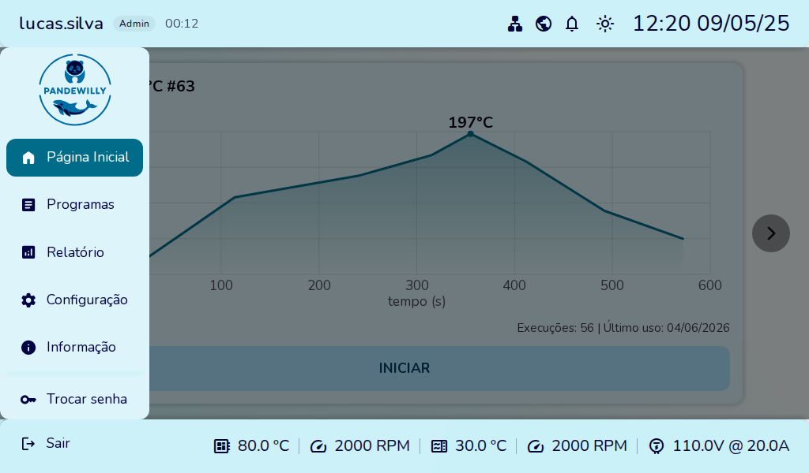

- **Página Inicial** — monitoramento e execução;
- **Programas** — lista de perfis de temperatura;
- **Relatório** — execuções, alterações e erros;
- **Configuração** — ajustes do sistema, usuários, rede…;
- **Informação** — dados do equipamento;
- **Trocar senha** — troca da sua própria senha;
- **Sair** — encerra a sessão.

> Os itens visíveis dependem do seu tipo de usuário (ver [seção 11](#11-permissões-por-tipo-de-usuário)).

**Em telas maiores (≥ 1280 px)** o menu não fica escondido — vira uma **barra lateral fixa** à esquerda,
sempre visível:

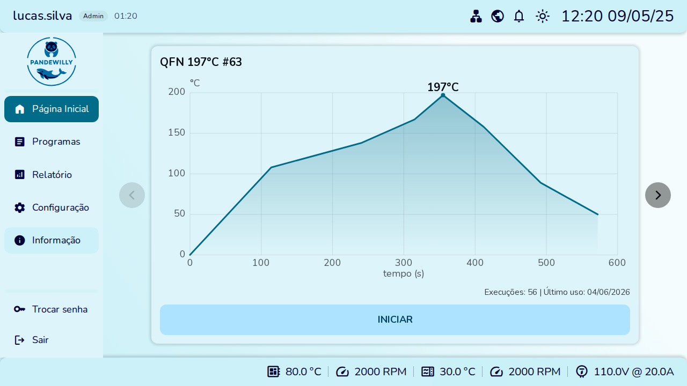

### Tema claro e escuro

O botão de **tema** (☀/🌙) na barra superior alterna a aparência. O modo escuro é ideal para ambientes com
pouca luz. A preferência fica salva na sua conta.

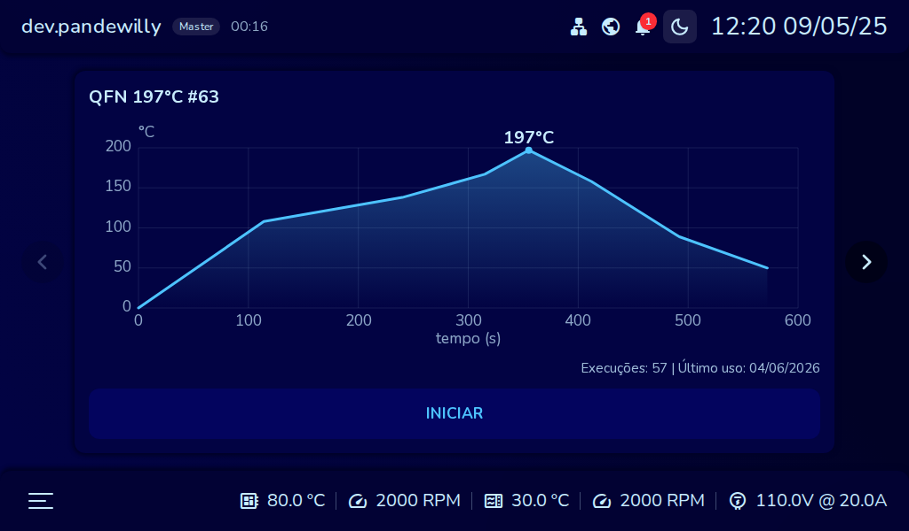

---

## 4. Início — monitoramento

A **Página Inicial** mostra **um programa por vez** com a sua curva de temperatura, junto do botão para
executá‑lo. Use as **setas ‹ ›** nas laterais para navegar entre os programas.

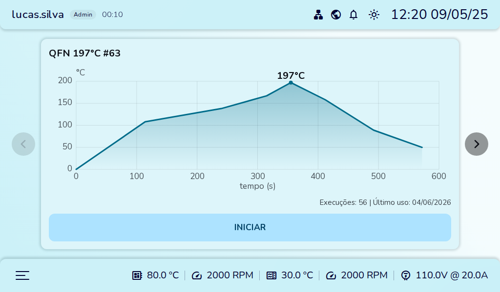

- O **título** mostra o nome do programa selecionado;
- O **gráfico** mostra a curva de temperatura (°C × tempo), com o ponto de **pico** destacado;
- Abaixo, **Execuções** (quantas vezes já rodou) e **Último uso**;
- O botão **INICIAR** começa a execução do programa exibido (ver próxima seção).

A barra inferior mostra as leituras ao vivo enquanto você navega.

---

## 5. Executar um programa

Na Página Inicial, com o programa desejado em tela, toque em **INICIAR**. A execução começa imediatamente e
abre a tela de acompanhamento ao vivo:

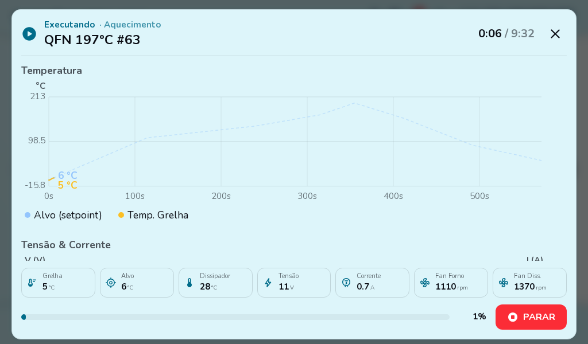

O que você vê:

- **Cabeçalho** — estado (**Executando**) e a **fase atual** (ex.: *Aquecimento*), o nome do programa e o
  **tempo decorrido / tempo total** (ex.: `0:06 / 9:32`);
- **Gráfico de Temperatura** — a curva **Alvo (setpoint)** programada (tracejada) e a **Temp. Grelha** real
  sendo desenhada ao vivo;
- **Tensão & Corrente** — gráfico dos sinais elétricos;
- **Cards de leitura** — Grelha, Alvo, Dissipador, Tensão, Corrente, Fan Forno e Fan Dissipador, atualizados a
  cada segundo;
- **Barra de progresso** com o percentual concluído;
- Botão **PARAR** (vermelho) para abortar a execução.

### Parar uma execução

Toque em **PARAR** e **confirme**. A execução é abortada com segurança e fica registrada nos
[Relatórios](#7-relatórios) com o status **Abortado**. Fechar a janela durante a execução também pede confirmação.

> Só é possível **uma execução por vez**. Se tentar iniciar outra com uma já em andamento, o sistema avisa
> *“Já existe uma execução em andamento.”*

---

## 6. Programas (perfis de temperatura)

Abra **Programas** no menu. Aqui ficam todos os perfis cadastrados, em **cards**:

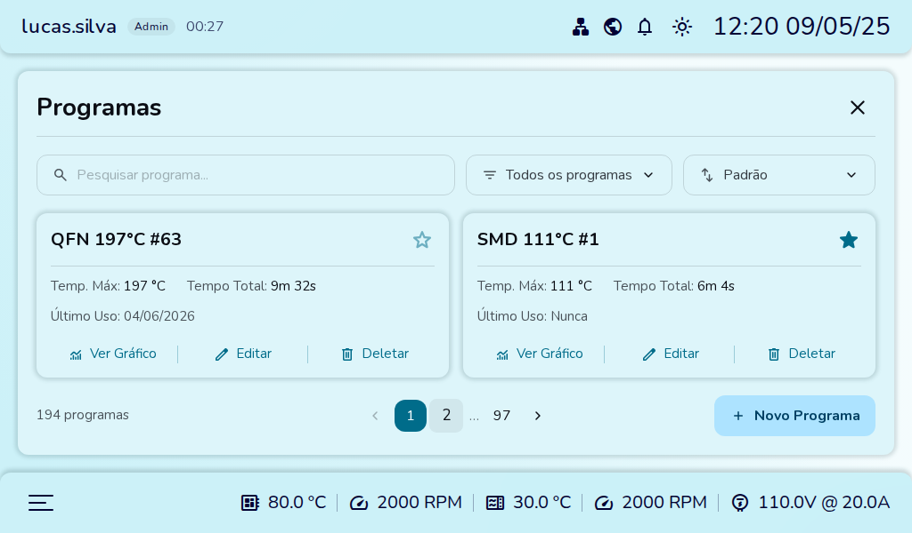

Cada card mostra **Temperatura máxima**, **Tempo total** e **Último uso**, e tem as ações:

- ⭐ **Favoritar** (estrela no topo) — favoritos aparecem primeiro;
- **Ver Gráfico** — abre a curva do perfil em tela cheia;
- **Editar** — abre o editor (somente Admin/Master);
- **Deletar** — remove o programa (somente Admin/Master; pede confirmação).

No topo: **Pesquisar**, **Filtrar** (todos / favoritos…) e **Ordenar** (Padrão, nome…). No rodapé: a
**paginação** e o botão **➕ Novo Programa**.

### Ver Gráfico

Mostra a curva de temperatura completa do programa (°C × tempo), com o ponto de pico destacado — útil para
conferir o perfil antes de executar.

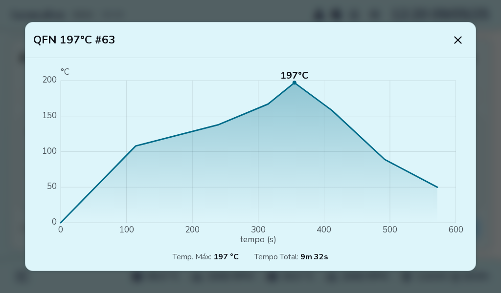

### Criar / editar um programa

Toque em **Novo Programa** (ou **Editar** num card). *Disponível para Admin/Master.*

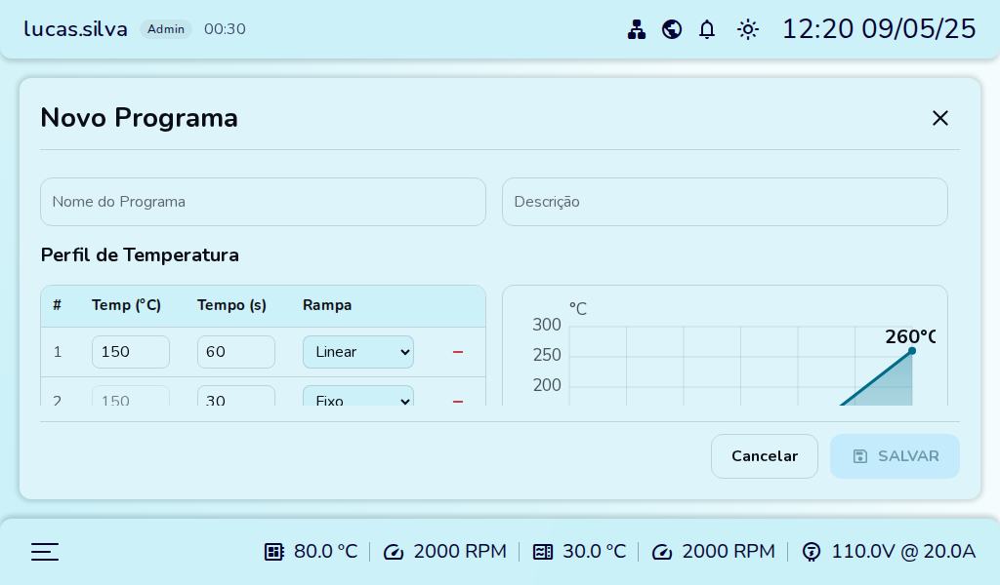

1. Preencha **Nome do Programa** e (opcional) **Descrição**.
2. Em **Perfil de Temperatura**, monte a curva ponto a ponto na tabela:
   - **Temp (°C)** — a temperatura‑alvo do ponto;
   - **Tempo (s)** — a duração até esse ponto;
   - **Rampa** — **Linear** (sobe/desce gradualmente) ou **Fixo** (mantém a temperatura);
   - o **−** vermelho remove a linha.
3. O **gráfico ao lado** mostra a curva sendo montada em tempo real.
4. Toque em **SALVAR**.

> **Limites:** cada campo tem mínimo/máximo e a lista tem um número máximo de pontos — o sistema impede valores
> fora da faixa (inclusive ao colar). As temperaturas/tempos são gravados com até 2 casas decimais.

---

## 7. Relatórios

Abra **Relatório** no menu. São três abas: **Execuções**, **Alterações** e **Erros**. Todas têm **filtro por
intervalo de datas**, **busca** e **paginação**. Toque no ícone à direita de cada linha para ver o **detalhe**.

### Execuções

Histórico de tudo que foi executado, com **Início**, **Duração** e **Status** (Concluído, Abortado, Falha).

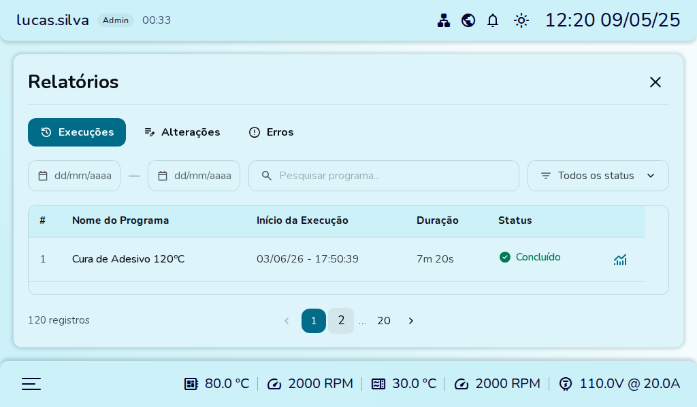

O detalhe compara a curva **Programado × Real** e mostra os **sinais da execução** (temperaturas, tensão,
corrente, coolers) sincronizados:

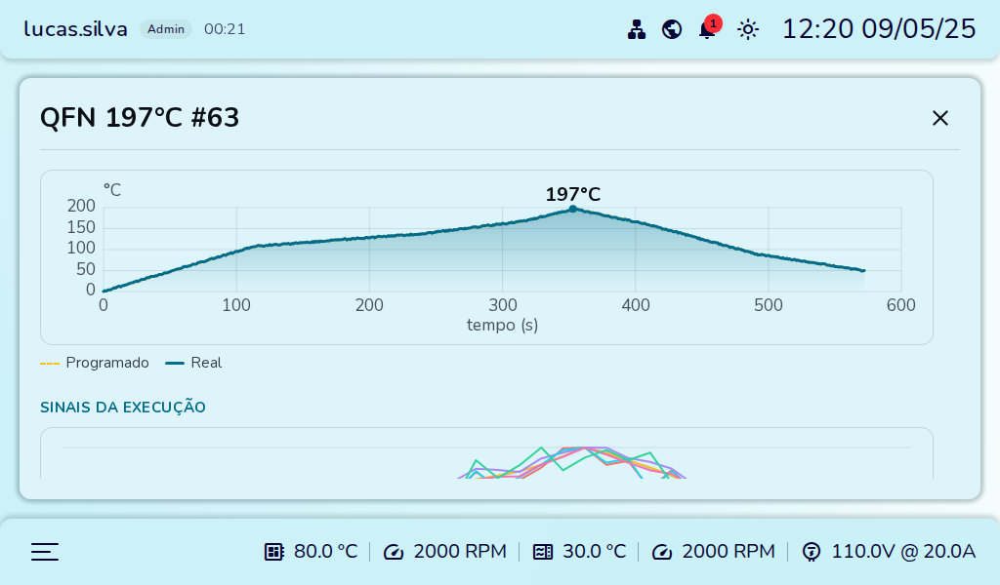

### Alterações

Auditoria de **mudanças nos programas** — quem criou/editou/removeu, quando e o quê. Filtro por **ação**.

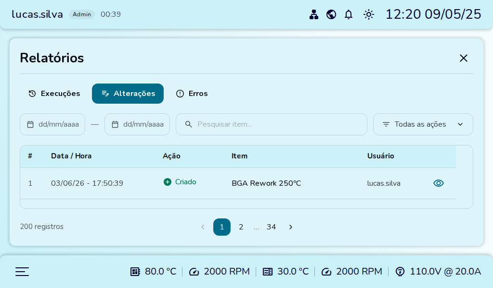

O detalhe mostra a **curva resultante** e o **histórico de edições** (marque as caixas para sobrepor versões
anteriores no gráfico) e a tabela de pontos:

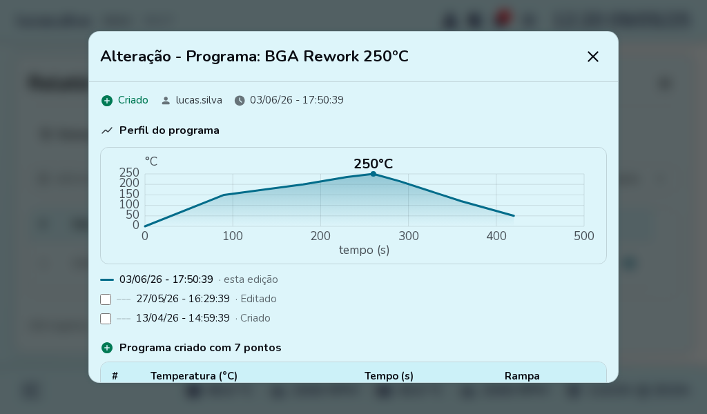

### Erros

Falhas registradas, com **Severidade** (Crítico, Alerta, Aviso), **Código** e **Descrição**. Filtro por
severidade.

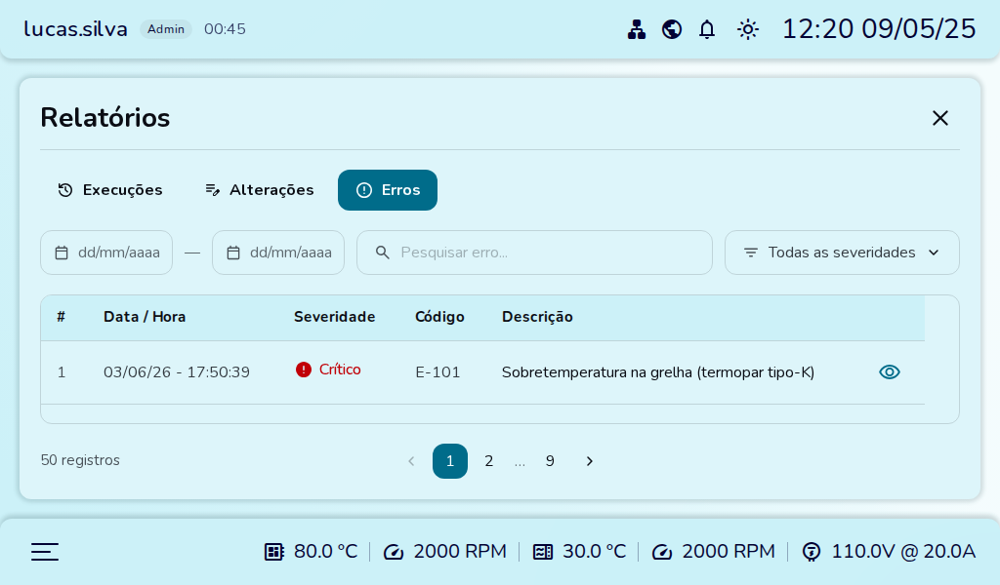

O detalhe traz o **“Snapshot da falha”** — o estado de **todos os sensores no instante do erro**, num gráfico
interativo, além do programa/usuário envolvidos:

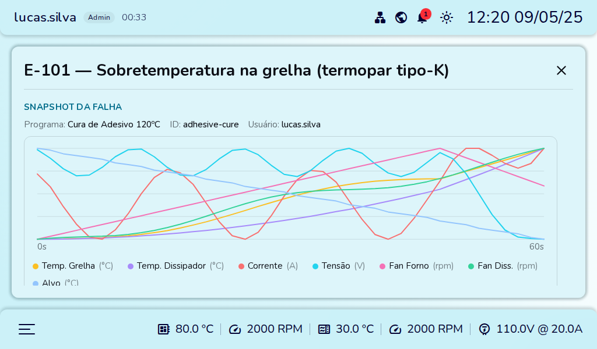

---

## 8. Notificações

O **sino** 🔔 na barra superior abre a tela de **Notificações** (o número vermelho indica não lidas).

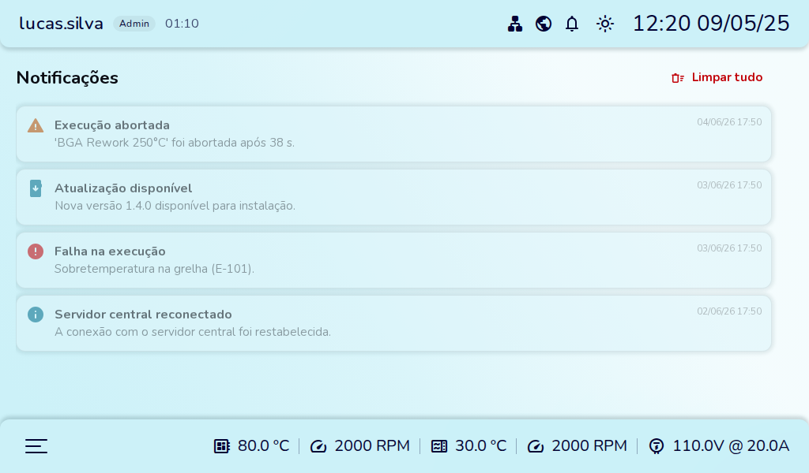

Cada notificação tem um **ícone por tipo**:

- ⚠ **Aviso** (âmbar) — ex.: *Execução abortada*;
- ⛔ **Falha/Erro** (vermelho) — ex.: *Falha na execução — Sobretemperatura na grelha*;
- ℹ / 🔄 **Informação** (azul) — ex.: *Atualização disponível*, *Servidor reconectado*.

O botão **Limpar tudo** marca todas como lidas.

---

## 9. Configurações

Abra **Configuração** no menu. As abas disponíveis dependem do seu tipo de usuário.

### Geral

Parâmetros de controle do forno — os ganhos do **PID** (P, I, D) e ajustes do **Forno**. Cada campo tem
mínimo/máximo. Toque em **SALVAR** para aplicar.

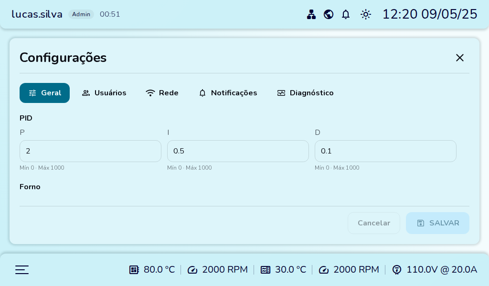

### Usuários

Gerência de contas. A tabela mostra **Usuário**, **Tipo**, **Status** (Ativo/Inativo) e **Último Login**, com
**filtro por data/tipo** e **busca**.

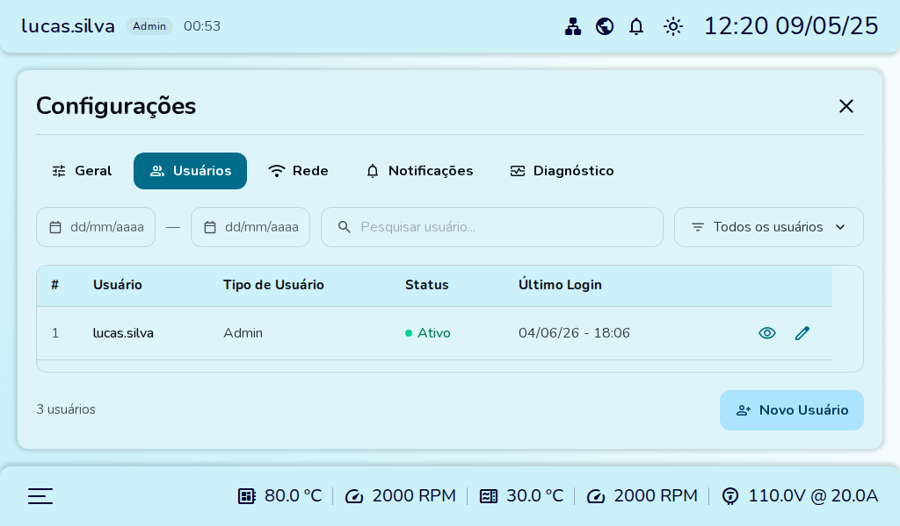

- 👁 **Ver** e ✏ **Editar** em cada linha;
- **Remover** aparece para quem pode excluir — **você nunca vê o botão de remover na sua própria linha**;
- **➕ Novo Usuário** abre o cadastro:

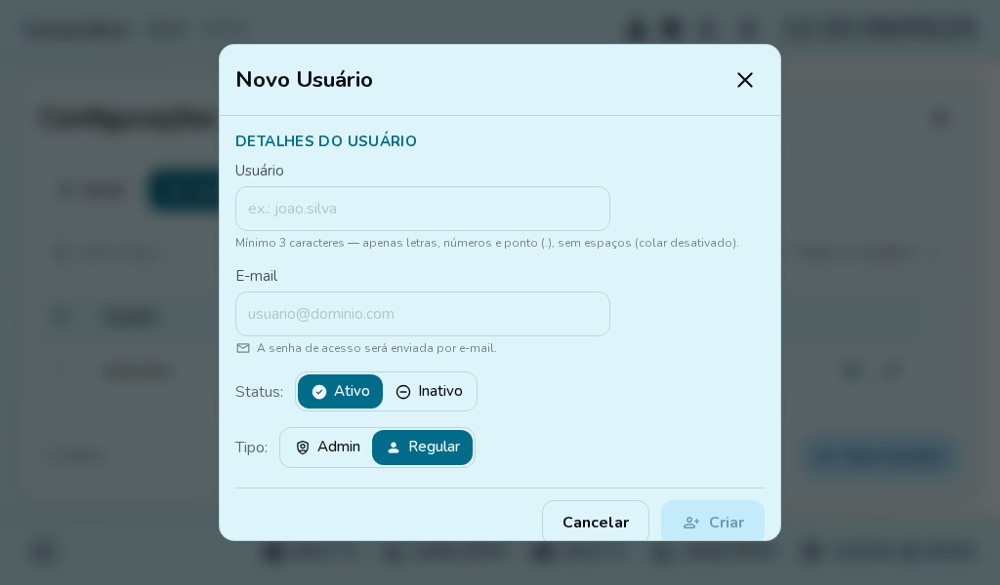

No cadastro, informe **Usuário** (mín. 3 caracteres; letras, números e ponto) e **E‑mail**. **A senha é gerada e
enviada por e‑mail** — você não a digita. Escolha **Status** (Ativo/Inativo) e **Tipo** (Admin/Regular) e toque
em **Criar**.

### Rede

Lista as **interfaces de rede** (cabo `eth0`, Wi‑Fi `wlan0`) com status e IP. Use **Definir como prioritária**
para escolher por qual interface o equipamento se comunica. (A aba também permite testar conectividade — *ping*.)

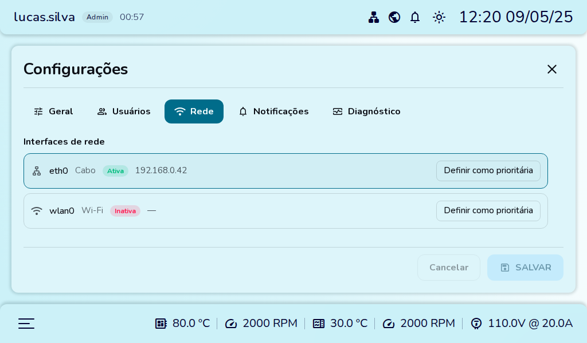

### Notificações

Define, **por tipo de alerta**, o comportamento do sistema:

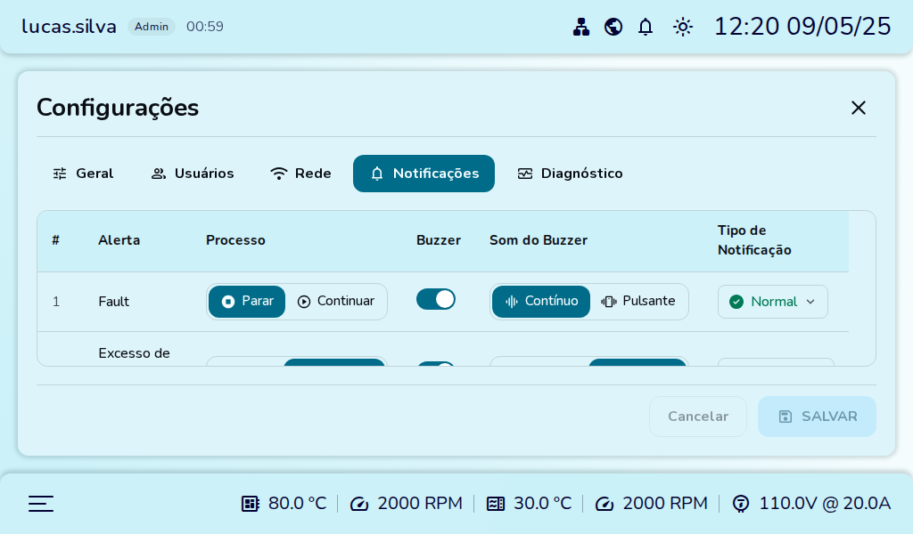

- **Processo** — **Parar** ou **Continuar** a execução quando o alerta ocorre;
- **Buzzer** — liga/desliga o som;
- **Som do Buzzer** — **Contínuo** ou **Pulsante**;
- **Tipo de Notificação** — prioridade (Normal…).

### Diagnóstico

Reúne estatísticas e ferramentas de manutenção, em sub‑abas.

**Estatísticas** — números gerais (programas, execuções, falhas, usuários ativos/inativos, administradores),
falhas por tipo e rankings (usuários que mais logam, programas mais usados).

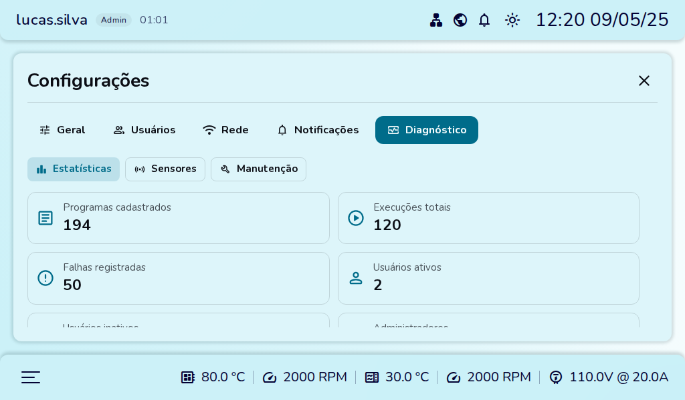

**Sensores** — **leituras ao vivo** de cada sensor com indicador **OK/alerta**, e acesso ao **Log do Sistema**.

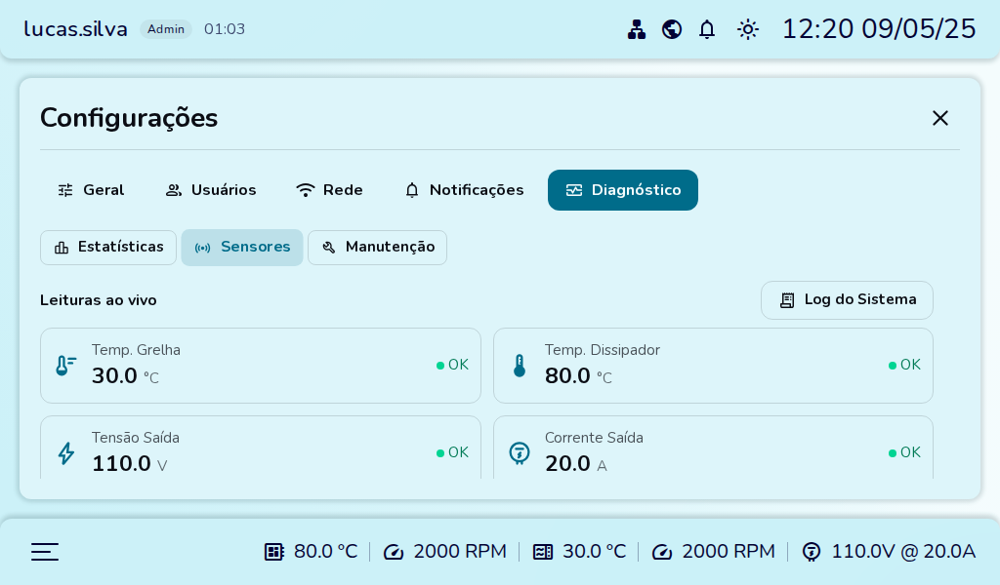

**Manutenção** — informações do equipamento (tamanho do banco, espaço em disco, SO/kernel) e as ações
**Limpeza do banco** e **Reset de fábrica**.

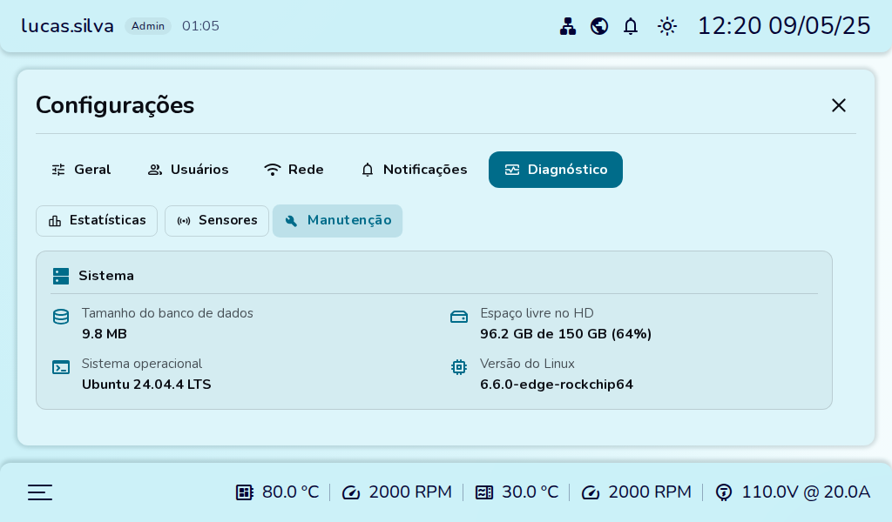

A **Limpeza do banco** permite remover, por categoria (histórico de execuções, registro de falhas, logs,
programas…), mostrando **quantos itens e quanto espaço** cada um ocupa. **A ação é permanente.**

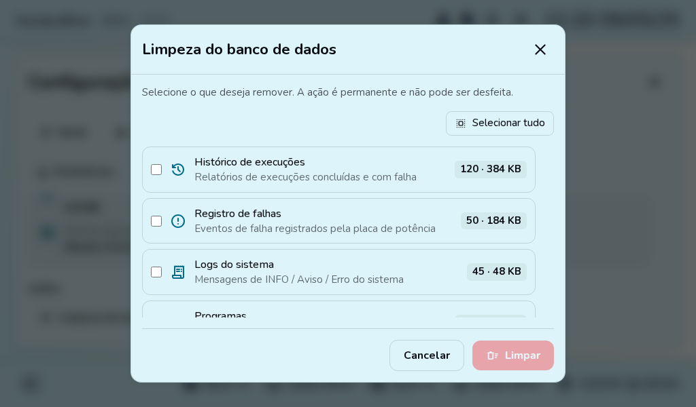

> **Permissões:** limpar Programas e Usuários é restrito ao **Admin** — o Master vê o tamanho, mas com 🔒.

---

## 10. Informação

Abra **Informação** no menu. Resume o estado do equipamento: **armazenamento**, **carga da CPU** (e
temperatura), **IP da placa**, e as **versões** (interface/HTML, firmware da Placa de Potência, backend da
Placa de Controle). O **QR Code** leva ao repositório do projeto.

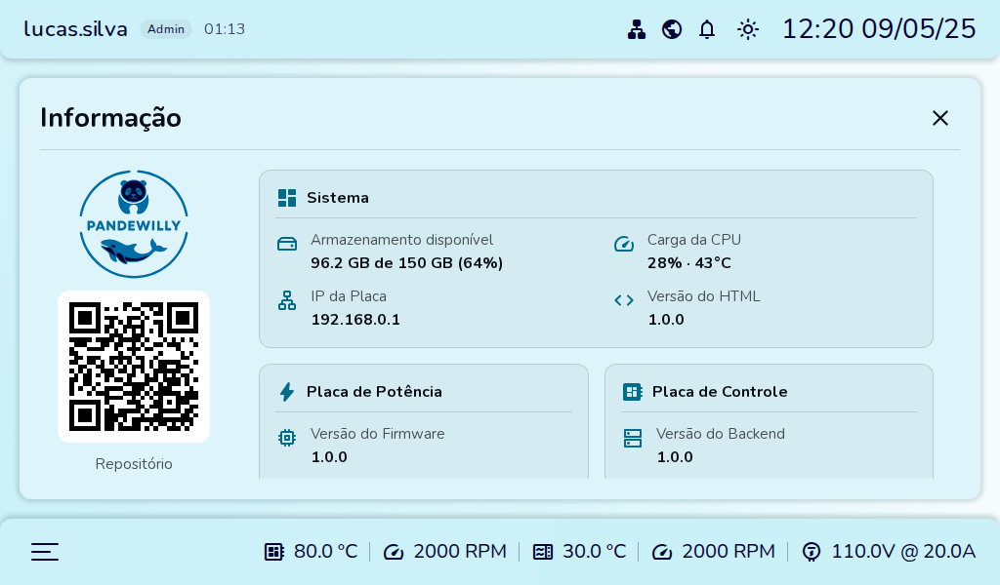

---

## 11. Permissões por tipo de usuário

O que cada conta vê e pode fazer:

| Recurso | Regular (operador) | Admin | Master | Técnico (calibração) |
|---|:---:|:---:|:---:|:---:|
| Início + executar programas | ✅ | ✅ | ✅ | ✅ |
| Ver / favoritar programas | ✅ | ✅ | ✅ | ✅ |
| Criar / editar / excluir programas | — | ✅ | ✅¹ | — |
| Relatórios | — | ✅ | ✅ | — |
| Configurações (Geral/Usuários/Rede/Notif.) | — | ✅ | ✅ | — |
| Diagnóstico → **Log de Operação** | — | — | ✅ | — |
| **Lixeira** (restaurar/excluir definitivo) | — | — | ✅ | — |
| **Calibração** (técnica) | — | — | — | ✅ |

¹ O Master só edita/exclui os **programas e usuários criados por ele**; os demais nem mostram o botão.

O **Regular** vê um menu enxuto — só **Página Inicial** e **Programas**:

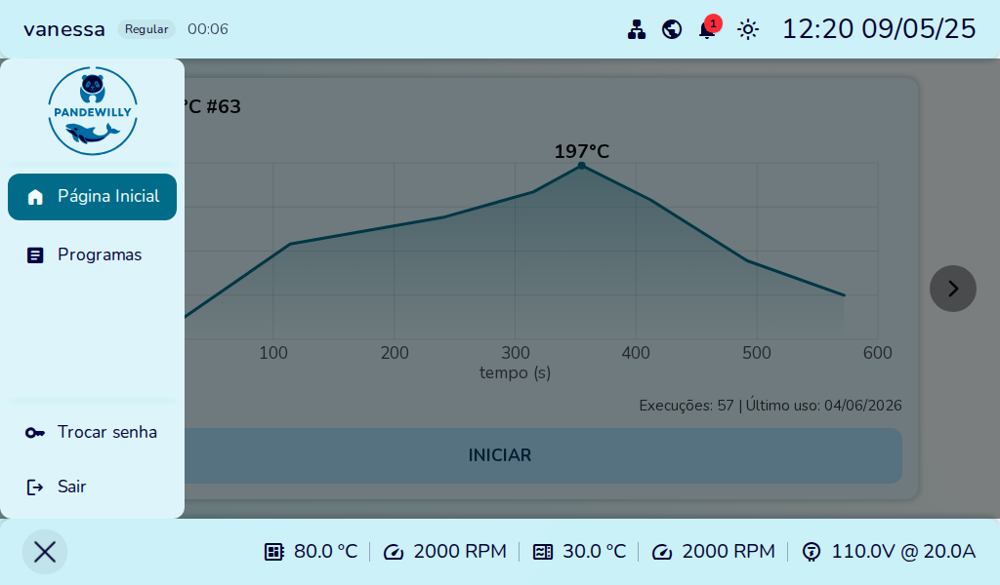

### Recursos exclusivos do Master

**Log de Operação** (em Diagnóstico → **Log**) — a **auditoria completa**: cada execução, alteração, login,
erro, comunicação, calibração e manutenção fica registrada. Tem **filtro por categoria** e **paginação**, com as
colunas Data · Operador · Tipo · Objeto · Objeto ID · Dados.

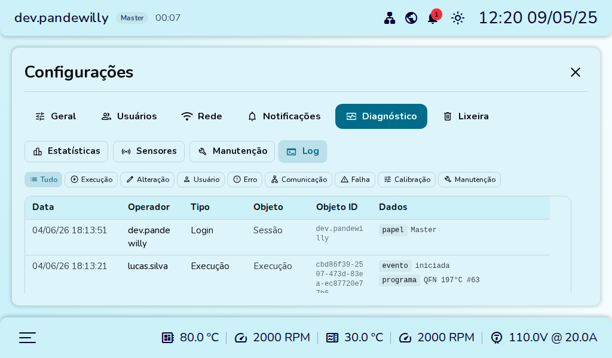

**Lixeira** — itens excluídos (programas, usuários, notificações) vão para cá em vez de sumir. O Master pode
**Restaurar** ou **Excluir definitivamente** cada item.

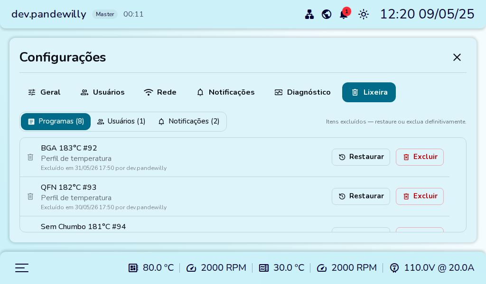

### Calibração (acesso técnico)

A aba **Calibração** (modo técnico) permite ajustar finamente sensores e atuadores — por exemplo, o **offset de
temperatura** do termopar tipo‑K, dentro de limites seguros. **Ajuste com cuidado.**

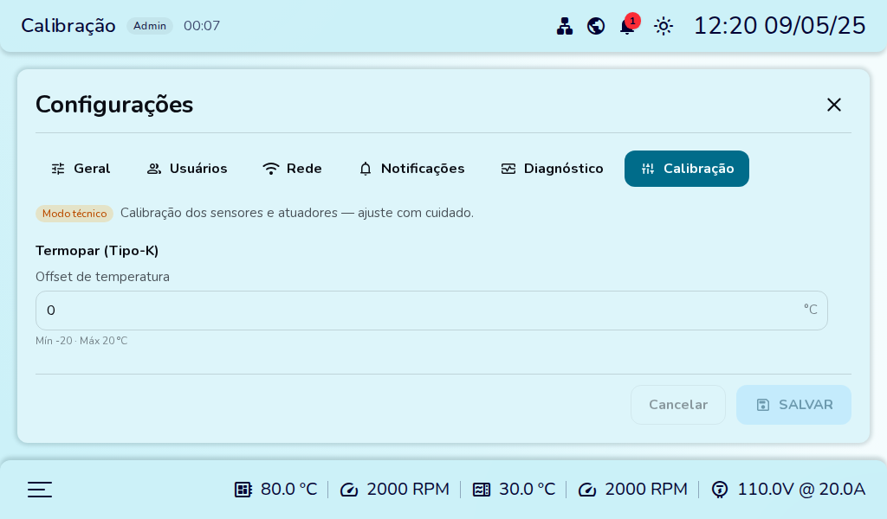

---

## 12. Solução de problemas

**A tela de login mostra um aviso de conexão / não entra.**
O equipamento não está conseguindo falar com o servidor. Verifique:
- se o **servidor/backend está ligado**;
- o **cabo de rede** ou o **Wi‑Fi** (ícone de rede na barra superior);
- as configurações em **Configuração → Rede** (interface prioritária / *ping*).

**Os ícones de rede/internet aparecem “apagados”.**
Sem conexão local (rede) ou sem internet (globo). Conecte o cabo/Wi‑Fi; o ícone acende quando a conexão volta.

**Não consigo iniciar um programa (“Já existe uma execução em andamento”).**
Há uma execução ativa. Abra‑a e use **PARAR**, ou aguarde terminar — só roda uma por vez.

**Não vejo as abas Relatório/Configuração (ou o botão de remover/editar).**
É uma questão de **permissão** — seu tipo de usuário não tem acesso a esse recurso (ver
[seção 11](#11-permissões-por-tipo-de-usuário)). Fale com um administrador.

**Esqueci a senha.**
Use **Esqueceu a senha?** na tela de login e siga as instruções enviadas ao seu e‑mail.

**A temperatura/leitura parece travada.**
Confira em **Configuração → Diagnóstico → Sensores** se o sensor está **OK**; verifique falhas em
**Relatório → Erros**.

---

*Manual gerado a partir do sistema em execução. As telas podem variar levemente conforme a versão e o tipo de
usuário.*
